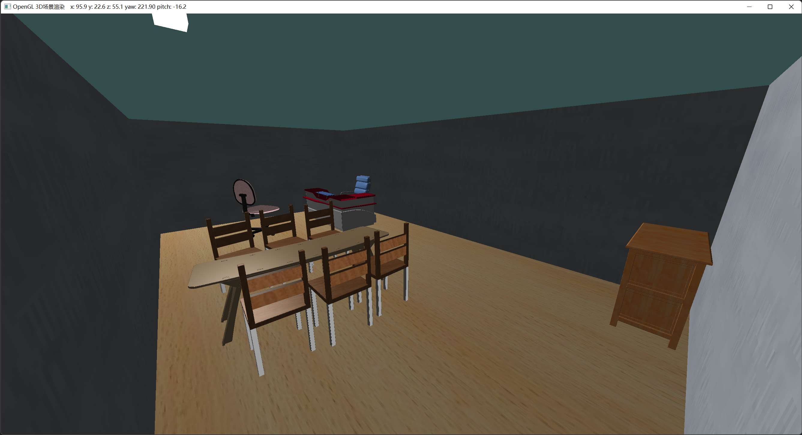
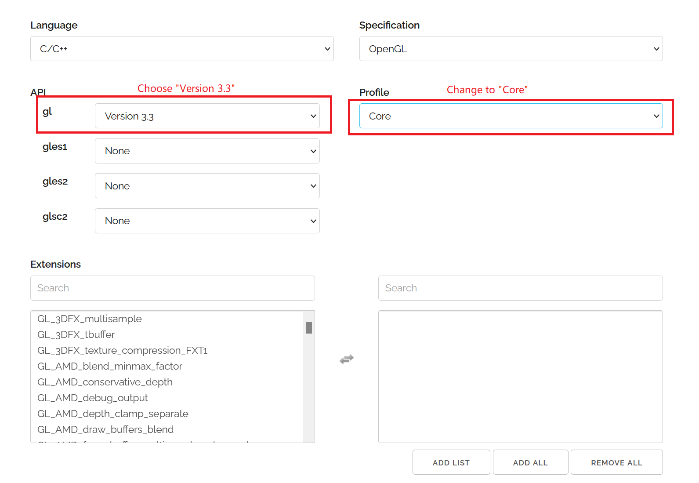
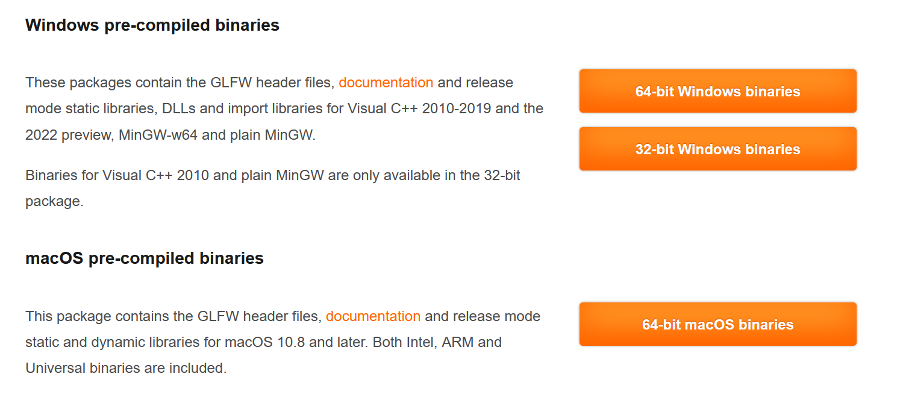

# Scene-OpenGL-CPP
This repository is my homework in computer graphics course, which build a dynamic scene with simple lighting and materials. Base on C++ 20, this project use [glad](https://www.glad.org/) to locate OPenGL function address [glm](https://github.com/g-truc/glm) as matrix calculation library, [glfw](https://www.glfw.org/) for windows management and [stb_image](https://github.com/nothings/stb) to read image file. In addition to the configured cmake project, a guide for configuring OpenGL is also provided here. I hope these can help those who are learning OpenGL.

## Platform

This project has been tested in both Windows and MacOS.

- Windows 11 x86 arch
- MacOS Apple Silicon/Intel

## Screenshot



- `W`, `S`, `A`, `D` to move
- mouse movement to control perspective
- `left mouse button` to capture / release cursor
- `middle mouse button  to `start / stop light source movement
- `mouse whell` to control perspective
- `ESC` to quit application


## Guide to configure OpenGL project

1. Download and configure glad.

   Here we download it from a online loader generator. https://glad.dav1d.de/. Note that you need to modify some options:

   > API->gl: Version 3.3
   >
   > Profile: Core

   

   and than click generate. You will get a url like this: 

   https://glad.dav1d.de/#language=c&specification=gl&api=gl%3D3.3&api=gles1%3Dnone&api=gles2%3Dnone&api=glsc2%3Dnone&profile=core&loader=on

   It contains header file in `include` and source file in `src`.

2. Download glfw

   https://www.glfw.org/download.html

   For sake of simplicity, we DO NOT build it from source, but use compiled binaries. 

   

   You will get a lot of  library and two header file.

3. Download glm

   glm is a header only math library, just download it from: https://github.com/g-truc/glm/releases/

4. Arrange the file results of the project appropriately and write `CMakeLists.txt`

   This project gives a reference organization: all header files are placed in the `include`, all source files are placed in `src`, all libraries that need to be linked are placed in `lib` and the code written by yourself is directly placed in the root directory.

   If organized in this way, the `CMakeLists.txt` configuration file is as follows:

   ```cmake
   cmake_minimum_required(VERSION 3.20)
   project(CG_Lab2)
   set(CMAKE_C_STANDARD 11)
   set(CMAKE_CXX_STANDARD 20)
   IF (WIN32)
   	# link library for msvc
       if (CMAKE_CL_64)
           link_directories(${PROJECT_SOURCE_DIR}/lib/msvc/x64)
       else()
           link_directories(${PROJECT_SOURCE_DIR}/lib/msvc/)
       endif()
       set(CMAKE_CXX_FLAGS "-W4")
   ELSEIF (APPLE)
   	# link library for apple clang
       link_directories(${PROJECT_SOURCE_DIR}/lib/apple/)
       # IMPORTANT: to use glfw in MacOS, we need to specify `-framework` argument.
       set(CMAKE_EXE_LINKER_FLAGS "-framework Cocoa -framework OpenGL -framework IOKit -framework CoreVideo -framework CoreFoundation")
       set(CMAKE_CXX_FLAGS "-Wall")
   ELSE ()
       MESSAGE("Unsupported operate system: ${CMAKE_SYSTEM_NAME}")
   ENDIF ()
   find_package(OpenGL REQUIRED)
   include_directories(${PROJECT_SOURCE_DIR}/include)
   link_directories(${PROJECT_SOURCE_DIR}/lib)
   add_executable(CG_Lab2 main.cpp src/glad.c include/stb_image.h shader.h model.h model.cpp shader.cpp camera.h loader.h loader.cpp shader_code.h)
   target_link_libraries(CG_Lab2 ${OPENGL_LIBRARY} glfw3)
   ```


## License

**For ease of use, this repository also packs the code of some open source projects or network resources for learning only. Please pay attention to its copyright.**

***

For the code I wrote(see the copyright notice at the top of the file), I use the MIT license.

**MIT License**

Copyright (c) 2022 ColorsWind

Permission is hereby granted, free of charge, to any person obtaining a copy of this software and associated documentation files (the  "Software"), to deal in the Software without restriction, including  without limitation the rights to use, copy, modify, merge, publish,  distribute, sublicense, and/or sell copies of the Software, and to  permit persons to whom the Software is furnished to do so, subject to  the following conditions:

The above copyright notice and this permission notice shall be included in all copies or substantial portions of the Software.

THE SOFTWARE IS PROVIDED "AS IS", WITHOUT WARRANTY OF ANY KIND,  EXPRESS OR IMPLIED, INCLUDING BUT NOT LIMITED TO THE WARRANTIES OF  MERCHANTABILITY, FITNESS FOR A PARTICULAR PURPOSE AND NONINFRINGEMENT.  IN NO EVENT SHALL THE AUTHORS OR COPYRIGHT HOLDERS BE LIABLE FOR ANY  CLAIM, DAMAGES OR OTHER LIABILITY, WHETHER IN AN ACTION OF CONTRACT,  TORT OR OTHERWISE, ARISING FROM, OUT OF OR IN CONNECTION WITH THE  SOFTWARE OR THE USE OR OTHER DEALINGS IN THE SOFTWARE.


## Acknowledgment

The  [LearnOpenGL](https://learnopengl.com/)([CN](https://learnopengl-cn.github.io/)) tutorial has brought me great help to this project. Some of the codes refer to the reference codes provided by the author.
